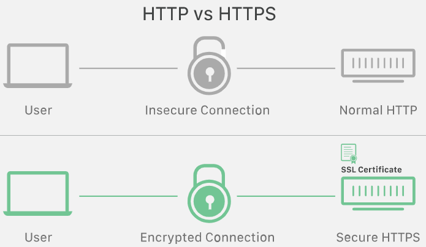

# HTTP & HTTPS

Created By: 창 현
Last Edited: Jan 19, 2021 7:48 PM

## HTTPS를 도입하게 된 이유

HTTP 통신에서는 server에서 client로 정보를 전달할 때 암호화되지 않은 연결을 통해 통신한다.

가령, client의 user가 신용카드 결제 정보를 입력할 경우 http 프로토콜에서는 입력된 정보를 문자 그대로 전송한다. 따라서 이는 사이버 공격에 취약하다는 단점을 가지게 된다.

HTTPS는 이를 극복하고자 SSL(secure sockets layer) certificate를 이용해 server와 client의 통신 과정에서 secure encrypted connection을 유지한다. 

현대에는 SSL 프로토콜이 발전해 TLS 프로토콜이 개발되었고 이러한 보안 프로토콜을 사용할 경우 url에서 http를 https로 대체한다.

유저가 웹페이지에 연결되면, webpage는 secure session을 시작하기 위해 필요한 public key 정보를  담는 SSL/TLS 인증서를  발급한다. 인증서를 발급받은 후에 client와 server는 SSL/TLS handshake라 불리는 프로세스를 통해 secure한 connection에서 통신 데이터를 주고받는다.

## Which is better?

HTTP와 HTTPS를 비교해보면, 보안에 뛰어난 HTTPS를 사용하는 것이 당연한 것처럼 생각될 수 있지만, e-commerce와 같은 보안에 민감한 정보를 다루는 것이 아니라면 HTTPS site로 전환하는 과정에서 큰 비용을 치뤄야하기에 장단점을 고려해 적용할 필요가 있다.

HTTP에서 HTTPS로 변환하는 것은 SEO 향상에도 도움이 된다.  구글에서는 HTTPS로 전환하는 것이 SEO ranking에 큰 도움이 될 것이라 설명한다. 

HTTPS 사이트는 모든 통신 과정을 암호화하기 떄문에, site 방문자들은 암호, 신용 카드, 검색 기록과 같은 정보들로부터 보호받을 수 있다. 

## SSL(Secure Sockets Layer) ?

[https://www.cloudflare.com/learning/ssl/what-is-ssl/](https://www.cloudflare.com/learning/ssl/what-is-ssl/)

- 암호화 기반의 인터넷 보안 프로토콜
- 1995년 netscape에 의해 개발됨
- SSL의 다음 보안 프로토콜로는 TLS가 있다.

HTTP와 SSL/TLS 보안 프로토콜에 의해 동작하는 website는 URL에서 HTTP 대신 HTTPS를 사용한다.

## SSL/TLS 동작 방식

ssl로 전송 data를 암호화한 결과

- SSL은 web에서 전송되는 data를 해독하기 어려운 문자열로 암호화한다.
- SSL은 handshake라는 인증 절차를 통해 송수신하는 두 장치를 확인한다.
- SSL은 데이터 무결성(integrity)을 위해 디지털 방식으로 데이터를 sign하고 data 수취인에게 도착하기 전에 변경된 내용이 없는지 확인한다.

## SSL/TLS가 중요한 이유?

ex) user가 website에서 신용카드 정보를 입력했을 떄 입력된 정보가 그대로 전송되는데 SSL은 이를 암호화해주고, cyber attack이 발생할 경우 위조 사이트인지 판단하기 위해 server를 authenticate하고 

data 간섭을 방지한다.

## SSL certificate는 무엇인가?

SSL은 SSL certificate를 가지고 있는 website에서만 구현되고 certificate는 website server에 의해서 저장되고 보여진다.

SSL 인증서에서 가장 중요한 부분은 website의 public key이다. public key는 인증을 가능하게 한다.

user의 device는 website의 public key를 확인하고, 이를 통해 web server와 안전한 암호화된 키를 생성한다. web server 또한 private key를 보안화하여 가지고 있으며, 이를 통해 website에서 암호화된 data를 해독한다.

## SSL certificate이 담는 정보

- domain name
- 인증서를 발행한 사람/조직/장비
- 어떤 CA(Certificate Authority)가 발행했는지
- 허가된 subdomains
- 발행/만료일
- public key

## SSL 인증서의 종류

SSL 인증서는 적용되는 웹사이트의 개수에 따라 여러 종류로 나뉜다.

- single-domain : 하나의 도메인에 적용된다.
- wildcard : 서브도메인까지 적용된다. ex) [www.naver.com](http://www.naver.com) , blog.naver.com
- multi-domain : 여러 도메인 지원

SSL 인증서는 validate하는 기준에 따라 분류될 수도 있다.

- domain validation : 가장 저렴하고 낮은 수준의 validate을 제공한다.
- organization validation : CA(Certificate Authorities)가 직접적으로 certificate를 요청하는 사람 또는 기업에 컨택한다.
- extended validation : SSL이 발행되기 전에 모든 background를 검토한다.

## TLS handshake란

[https://www.cloudflare.com/learning/ssl/what-happens-in-a-tls-handshake/](https://www.cloudflare.com/learning/ssl/what-happens-in-a-tls-handshake/)

## http에서 https로 전환하는 방법

[https://seopressor.com/blog/http-vs-https/](https://seopressor.com/blog/http-vs-https/)
